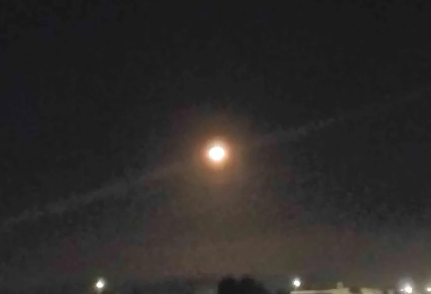

 

The moon is burning 
It blisters and bites 
It itches and scritches 
Like minnows and mites

At dawn, to our riches 
It curses and spits 
By night, it travails 
Our evils and grits

It wails like whales 
Mourning its warning 
And burns up the chair 
While the meet is adjourning

Stoplights flash -- 
Headlights flare 
Reddening plastic lawns 
Limp and limbless -- 
In its plea 
To peal for spent-up dawns

We killed it, you see? 
We killed the great moon 
On its flank it is flaming 
Where we struck our harpoon.

~ Brandon Chan

 
