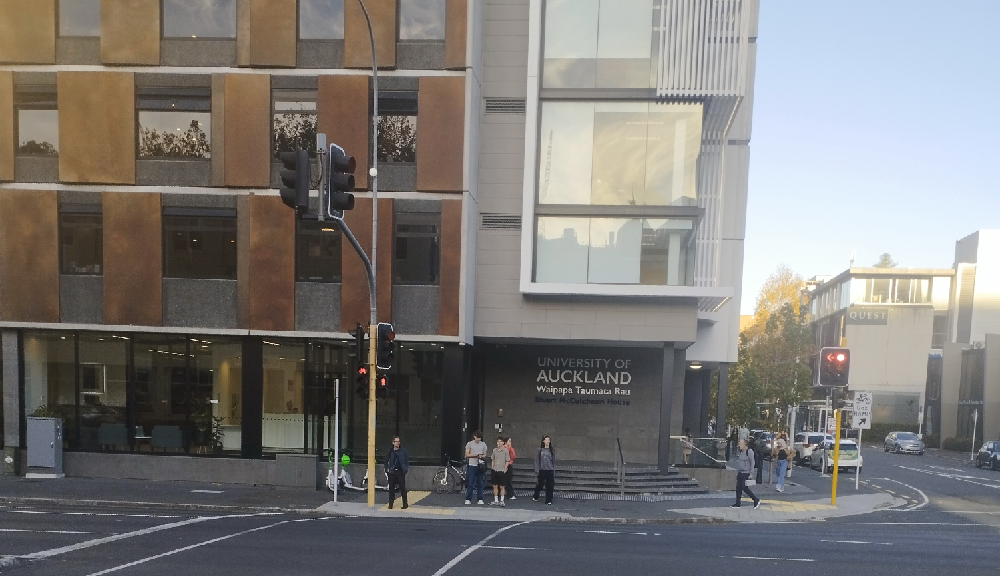

*On how university life would've be so much better if I'd lived in Carlaw Park Student Village. Or would it?*

*A parody of [:Crazy = Genius](https://www.youtube.com/watch?v=nLPTNumhyAY) by Panic! at the Disco* 
*[:Karaoke version](https://www.youtube.com/watch?v=DNjesaCnMhs)*

---

[Intro] 
Should've gone to live in Carlaw (Hey!) 
Should've gone to live in Carlaw (Hey!)

[Verse 1] 
She said, "At night, in my dreams 
I ride on a train of old age 
Oh, but when I wake up 
I'm on campus in the student village 
You're so sleepy like commuters 
With your schedules out of your mind 
There's a cost to waking at 6 AM 
To make it on time"

[Pre-Chorus] 
She said, "You're just like Dawn Fresh 
But you wanna be Stu McCutcheon, Stu McCutcheon" 
Said, "You're just like Dawn Fresh 
But you'll never be Stu McCutcheon"

[Chorus] 
And I said 
(Hey! Hey!) Cos Carlaw equals genius 
(Hey! Hey!) Cos Carlaw equals genius 
I'd be a concert pianist (Hey!) 
I'd be a 'puter scientist (Hey! Hey!) 
(Hey! Hey!) Cos Carlaw equals genius... 

[Post-Chorus] 
You can wait for City Rail Link (Hey! Hey!) 
But you're always gonna wait, wait, wait (Hey! Hey!) 
Should've gone to live in Carlaw (Hey! Hey!) 
Now you always will be late, late, late 
(Hey!)

[Verse 2] 
She said, "Hey bro, you know 
How the hall plays tricks on my brain 
And oh, I seem to believe 
That living here is faster than trains 
Other courses you have taken 
Force you to train in and come last 
But for every class, I waken late 
I burst in at twelve past"

[Pre-Chorus] 
She said, "You're just like Dawn Fresh 
But you wanna be Stu McCutcheon, Stu McCutcheon" 
Said, "You're just like Dawn Fresh 
But you'll never be Colin Maiden"

[Chorus] 
And I said 
(Hey! Hey!) Cos Carlaw equals genius 
(Hey! Hey!) Cos Carlaw equals genius 
I'd be a teaching resident (Hey!) 
I'd be a tech club president (Hey! Hey!) 
(Hey! Hey!) Cos Carlaw equals genius...

[Post-Chorus] 
You can wait for City Rail Link (Hey! Hey!) 
But you're always gonna wait, wait, wait (Hey! Hey!) 
Should've gone to live in Carlaw (Hey! Hey!) 
Now you always will be late, late, late 
(Hey!)

[Bridge] 
You can wait for City Rail Link (Hey! Hey!) 
But you should've lived in Carlaw (Hey! Hey!) 
You can wait for City Rail Link (Hey! Hey!) 
But you should've lived in Carlaw

[Chorus] 
And I said 
(Hey! Hey!) Cos Carlaw equals genius 
(Hey! Hey!) Cos Carlaw equals genius 
I'd be a software engineer (Hey!) 
I'd be at Shads drinkin' a beer (Hey! Hey!) 
(Hey! Hey!) Cos Carlaw equals genius...

[Post-Chorus] 
You can wait for City Rail Link (Hey! Hey!) 
But you're always gonna wait, wait, wait (Hey! Hey!) 
Should've gone to live in Carlaw (Hey! Hey!) 
I don't care if rents inflate, flate, flate 
(Hey!)

*Stuart McCutcheon House (SMH)*